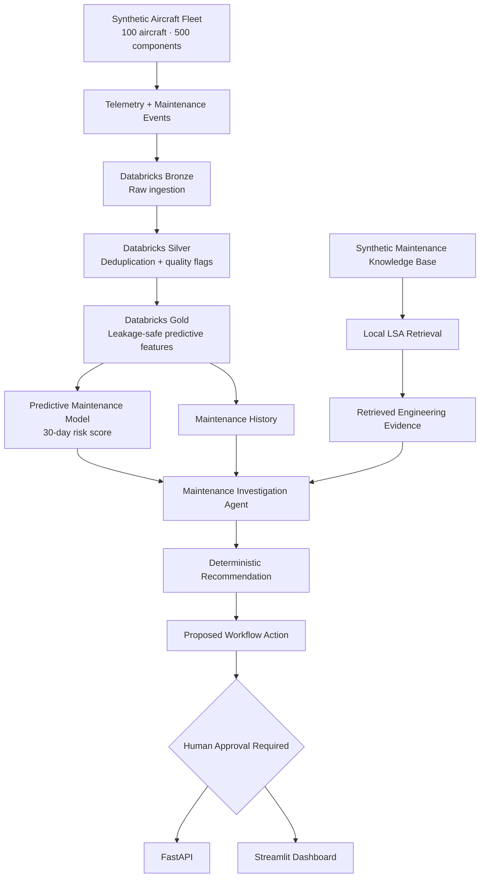
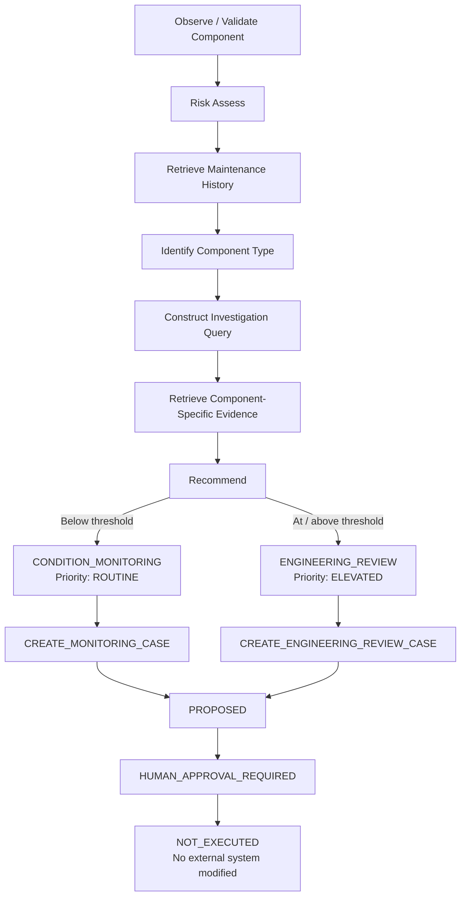
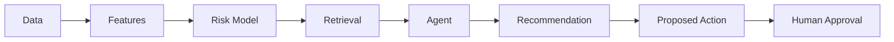

# AeroMaintain AI


### Aircraft Maintenance & Reliability Intelligence Platform


AeroMaintain AI is an end-to-end AI engineering portfolio project for **aircraft component maintenance intelligence**.


It combines a leakage-aware predictive maintenance model, maintenance-event history, local semantic retrieval, and an evidence-driven investigation agent with deterministic recommendations and human-gated action proposals into a single traceable workflow.


The platform is built around a simple question:


> **Given the latest condition of an aircraft component, what evidence should a maintenance analyst inspect next, and what controlled workflow action should be proposed for human review?**


The project demonstrates the complete lifecycle of an applied AI system: synthetic data generation, lakehouse pipelines, feature engineering, temporal ML evaluation, MLflow experiment tracking, semantic retrieval, agent orchestration, human-gated action proposals, API serving, automated testing, containerization, CI, and an interactive intelligence dashboard.


> **Important:** AeroMaintain AI uses entirely synthetic data and synthetic maintenance documentation. It is a decision-support demonstration and is **not** OEM-approved, regulatory, operational, or airworthiness guidance.


---


## Project at a Glance

**Fleet** · 100 aircraft · 500 components · 5 component categories
**Predictive task** · 30-day future component risk ranking
**Held-out ML** · PR-AUC **0.0713** vs. **0.0393** test prevalence
**Retrieval** · LSA Hit@1 **0.700** · Hit@3 **1.000** · MRR **0.850**
**Agent** · Deterministic evidence-driven investigation
**Action boundary** · Human-gated proposals · **NOT_EXECUTED**
**Serving** · FastAPI + Streamlit
**Engineering** · MLflow · Docker · GitHub Actions · **60 tests**

---

## System Overview


AeroMaintain transforms component telemetry into a traceable maintenance investigation.





The agent does not autonomously prescribe or execute maintenance actions. It assembles model risk, historical events, and retrieved engineering evidence, produces a deterministic recommendation, and creates a workflow action proposal that remains explicitly subject to human approval and is not executed by the system.


---


## What the Platform Does


For a component such as `CMP-00196`, AeroMaintain can:


1\. build the component's latest leakage-safe feature vector from telemetry,

2\. calculate a **30-day predictive risk score**,

3\. compare the score with the model's selected decision threshold,

4\. retrieve recent maintenance history,

5\. determine the component type,

6\. construct an investigation query,

7\. retrieve relevant passages from the synthetic maintenance knowledge base,

8\. produce a deterministic recommendation,

9\. propose a human-gated workflow action without executing it,

10\. return a structured evidence-driven investigation,

11\. expose the workflow through FastAPI and Streamlit.


The model output is intentionally presented as a **risk score**, not a calibrated probability of failure.


---


## Architecture


AeroMaintain is organized as a layered AI system rather than a single notebook.


### Data Layer


The synthetic fleet contains:


- **100 aircraft**

- **500 components**

- five component categories

- daily telemetry across one synthetic year

- maintenance events

- degradation and failure behavior

- controlled missing values, outliers, and duplicate records


The generator includes hidden degradation susceptibility and fleet-utilization effects to create learnable reliability structure without exposing those latent variables to the production model.


### Lakehouse Layer


The Databricks pipeline follows a Bronze / Silver / Gold architecture.


**Bronze**


Preserves raw synthetic telemetry for traceability.


**Silver**


Performs:


- duplicate removal,

- missing-temperature flagging,

- vibration-outlier flagging,

- preservation of observed failure events.


**Gold**


Builds the predictive feature table, including:


- aircraft and component attributes,

- component age and utilization,

- cycle-life ratio,

- maintenance recency,

- previous failures,

- current sensor measurements,

- 7-day and 30-day rolling statistics,

- short-term sensor deltas,

- a future 30-day failure target.


Right-censored observations near the end of the dataset are excluded from supervised training because their full future prediction horizon is unavailable.


---


## Predictive Maintenance ML


The predictive task is:


> Rank component observations by risk of a failure event occurring within the next 30 days.


### Leakage Controls


Several variables exist only to make the synthetic environment realistic and are deliberately excluded from model training.


Examples include:


- latent `health_index`,

- hidden component susceptibility,

- current failure-event indicators,

- future failure counts,

- metadata unavailable at inference time.


Data-quality fields whose computation would leak full-dataset information are also excluded from the production feature set.


### Temporal Evaluation


AeroMaintain uses a **purged temporal split**, not a random train/test split.


| Split | Period | Rows | Positive Rate |

|---|---:|---:|---:|

| Train | through 2025-08-01 | 106,500 | 2.49% |

| Validation | 2025-09-01 → 2025-09-30 | 15,000 | 2.67% |

| Test | 2025-10-31 → 2025-12-01 | 16,000 | 3.93% |


Thirty-day purge gaps separate the supervised windows to reduce overlap between prediction horizons.


### Model Selection


Two baseline models were evaluated:


- class-balanced Logistic Regression

- Random Forest


Validation performance favored Logistic Regression on the selected evaluation criteria.


| Validation Metric | Logistic Regression | Random Forest |

|---|---:|---:|

| PR-AUC | **0.0496** | 0.0353 |

| Best F1 | **0.1168** | 0.0889 |


The validation random baseline for PR-AUC was approximately `0.0267`.


The selected Logistic Regression decision threshold was approximately:


```text

0.7248

```


### Held-Out Test Performance


| Metric | Test Result |

|---|---:|

| PR-AUC | **0.0713** |

| ROC-AUC | **0.6811** |

| Precision | **0.0802** |

| Recall | **0.4006** |

| F1 | **0.1337** |

| Random PR baseline | 0.0393 |

| PR lift vs. random | **1.81×** |


Test confusion matrix:


```text

TN = 12,481    FP = 2,890

FN =    377    TP =   252

```


These results are intentionally reported without presenting the model as production-ready. The dataset is synthetic, the positive class is imbalanced, and the current model is best interpreted as a **risk-ranking baseline for decision support**.


---


## Experiment Tracking with MLflow


Model experiments are tracked with MLflow in Databricks.


Tracked information includes:


- model family,

- feature configuration,

- validation metrics,

- selected threshold,

- test metrics,

- project metadata,

- intended-use metadata.


The final inference bundle contains the fitted preprocessing pipeline, classifier, feature contract, decision threshold, prediction horizon, and model metadata.


The persisted artifact was reloaded and checked against the original model output to verify inference consistency.


---


## Local Semantic Retrieval


AeroMaintain includes a synthetic maintenance knowledge base covering:


- hydraulic pumps,

- generators,

- air cycle machines,

- fuel pumps,

- actuators.


The documents are intentionally synthetic and are **not** copied from OEM maintenance manuals.


Documents are chunked and indexed locally.


Two retrieval approaches were evaluated:


1\. TF-IDF lexical retrieval

2\. TF-IDF + Truncated SVD latent semantic retrieval (LSA)


### Retrieval Benchmark


A fixed 10-query synthetic benchmark is included in the repository.


| Retriever | Hit@1 | Hit@3 | MRR |

|---|---:|---:|---:|

| TF-IDF | 0.500 | 0.800 | 0.633 |

| **LSA** | **0.700** | **1.000** | **0.850** |


LSA therefore became the default retrieval strategy for the maintenance agent.


This is a measured result on the project's synthetic benchmark only; it is not presented as evidence of performance on real aircraft maintenance documentation.


---


## Evidence-Driven Maintenance Agent


The maintenance agent orchestrates deterministic tools rather than relying on an unconstrained LLM.


Its workflow is designed as a controlled decision-support loop:





The recommendation layer is deterministic and uses the predictive risk state, maintenance history, and retrieved evidence as its decision basis. A component below the configured threshold can receive a `CONDITION_MONITORING` recommendation, while an above-threshold component can be routed to `ENGINEERING_REVIEW`.


The action layer does **not** create a real maintenance case or execute a maintenance action. It only returns a structured proposal such as `CREATE_MONITORING_CASE` or `CREATE_ENGINEERING_REVIEW_CASE`.


Every action proposal explicitly records:


- `status = PROPOSED`,

- `approval_status = HUMAN_APPROVAL_REQUIRED`,

- `execution_status = NOT_EXECUTED`,

- `external_system_modified = False`.


The resulting investigation contract includes:


```text

component_id

component_type

risk

maintenance_history

retrieval_query

evidence

recommendation

action_proposal

summary

limitations

```


This design keeps the workflow traceable: model output, historical records, retrieved evidence, recommendation state, and proposed action remain individually inspectable. The agent is therefore an evidence-driven, tool-using investigation agent with human-gated action proposals, not autonomous maintenance authority.


---


## Streamlit Intelligence Dashboard


The Streamlit interface presents AeroMaintain as an aerospace intelligence workspace.


The dashboard includes:


- component investigation search,

- model risk score and threshold comparison,

- maintenance-history timeline,

- retrieved engineering evidence,

- deterministic recommendation and priority,

- human-gated proposed workflow action and approval state,

- investigation summary,

- model and retrieval status,

- system architecture context,

- explicit synthetic-data and decision-support labeling.


The interface deliberately avoids displaying the risk score as a calibrated failure probability.


---


## FastAPI Service


The project also exposes the maintenance workflow as a service layer.


Main endpoints:


```text

GET /

GET /health

GET /investigate/{component_id}

GET /components/{component_id}/risk

```


The investigation endpoint exposes the same structured agent contract used by the UI, including recommendation, action proposal, approval state, execution state, and safety limitations. This separates the core AI workflow from the user interface and demonstrates how the same investigation capabilities can be exposed programmatically.


---


## Repository Structure


```text

aeromaintain-ai/

│

├── app/

│   └── streamlit_app.py

│

├── artifacts/

│   └── predictive_maintenance_bundle.joblib

│

├── data/

│   ├── documents/

│   ├── processed/

│   └── raw/

│

├── databricks/

│   ├── 01_bronze.py

│   ├── 02_silver.py

│   ├── 03_gold.py

│   └── 04_ml_training.py

│

├── docs/

│   ├── architecture.md

│   ├── architecture-decisions.md

│   └── evaluation.md

│

├── evaluation/

│   ├── evaluate_retrieval.py

│   └── retrieval_queries.json

│

├── notebooks/

│   └── exploratory_analysis.ipynb

│

├── src/aeromaintain/

│   ├── agents/

│   ├── features/

│   ├── models/

│   ├── rag/

│   ├── synthetic/

│   ├── api/

│   └── config.py

│

├── tests/

├── Dockerfile

├── pyproject.toml

├── requirements.txt

└── README.md

```


---


## Local Setup


### 1. Clone the repository


```bash

git clone https://github.com/orcunku/aeromaintain-ai.git

cd aeromaintain-ai

```


### 2. Create a virtual environment


```bash

python -m venv .venv

source .venv/bin/activate

```


### 3. Install dependencies


```bash

python -m pip install --upgrade pip

pip install -r requirements.txt

pip install -e .

```


---


## Run the Streamlit Application


```bash

streamlit run app/streamlit_app.py

```


Then open the local Streamlit URL shown in the terminal.


Example component:


```text

CMP-00196

```


---


## Run the API


```bash

uvicorn aeromaintain.api.main:app --reload

```


Interactive API documentation is available through FastAPI's local `/docs` route while the server is running.


---


## Run the Test Suite


```bash

pytest -q

```


Current project checkpoint:


```text

60 passed

```


---


## Run Retrieval Evaluation


```bash

python evaluation/evaluate_retrieval.py

```


The benchmark compares the lexical TF-IDF baseline with the LSA semantic retrieval implementation.


---


## Technology Stack


| Layer | Technology |

|---|---|

| Language | Python |

| Data Processing | pandas, NumPy, PyArrow |

| Lakehouse | Databricks |

| ML | scikit-learn |

| Experiment Tracking | MLflow |

| Retrieval | TF-IDF, TruncatedSVD / LSA |

| Agent Orchestration | Custom deterministic Python agent + human-gated action proposals |

| API | FastAPI |

| UI | Streamlit |

| Testing | pytest — 60 automated tests |

| Containerization | Docker |

| CI | GitHub Actions |

| Version Control | Git / GitHub |


The retrieval and agent workflow can run locally without a paid LLM API.


---


## Engineering Decisions


AeroMaintain is designed to demonstrate more than model training.


The project emphasizes:


- temporal rather than random ML evaluation,

- explicit leakage prevention,

- right-censoring awareness,

- reproducible feature contracts,

- model artifact persistence,

- separation of training and inference,

- retrieval benchmarking,

- evidence traceability,

- deterministic agent orchestration,

- recommendation and human-gated action proposal contracts,

- API/UI separation,

- automated tests,

- clear limitations and intended-use boundaries.


---


## Safety and Limitations


AeroMaintain is a portfolio engineering system, not an operational aviation maintenance product.


Key limitations include:


- all fleet, telemetry, maintenance, and failure data are synthetic,

- maintenance knowledge-base documents are synthetic,

- component behavior is generated from simplified simulation assumptions,

- the predictive model is not calibrated as a failure probability model,

- the retrieval benchmark is small and synthetic,

- no OEM maintenance manuals are included,

- no regulatory maintenance data are included,

- no live aircraft systems are connected,

- proposed workflow actions are not executed and do not modify external maintenance systems,

- human approval is explicitly required before any real-world action,

- no maintenance action should be taken based on this project.


A real deployment would require validated operational data, domain-expert review, data-governance controls, model monitoring, calibrated risk communication, security controls, and compliance with the applicable aviation maintenance and airworthiness framework.


---


## Project Status


Core system implemented:


- [x] Synthetic fleet and telemetry generation

- [x] Bronze / Silver / Gold lakehouse pipeline

- [x] Leakage-safe predictive feature engineering

- [x] Purged temporal ML evaluation

- [x] MLflow experiment tracking

- [x] Persisted local inference pipeline

- [x] Synthetic maintenance knowledge base

- [x] TF-IDF retrieval baseline

- [x] LSA semantic retrieval

- [x] Retrieval evaluation framework

- [x] Evidence-driven maintenance agent

- [x] Deterministic recommendation layer

- [x] Human-gated action proposal layer

- [x] FastAPI service

- [x] Streamlit intelligence dashboard

- [x] Automated test suite

- [x] Containerized runtime

- [ ] Cloud demo deployment


---


## Why AeroMaintain?


The goal of AeroMaintain is not to claim that a simple model can automate aircraft maintenance.


The goal is to demonstrate how an AI engineer can design a **measurable, traceable, end-to-end decision-support system** around a safety-sensitive domain:





Every layer is designed so its output can be inspected independently rather than hidden behind a single generated answer.


---


## License


This project is intended for educational and portfolio demonstration purposes.


Synthetic project data and synthetic documentation should not be interpreted as real aircraft maintenance information.
